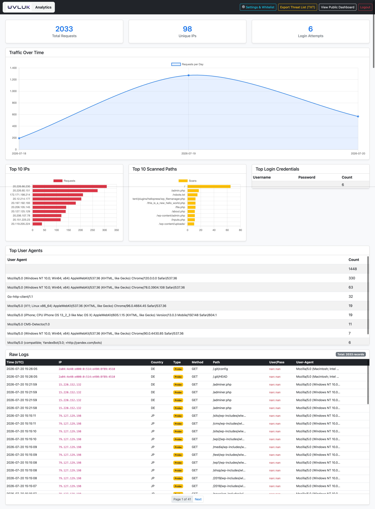
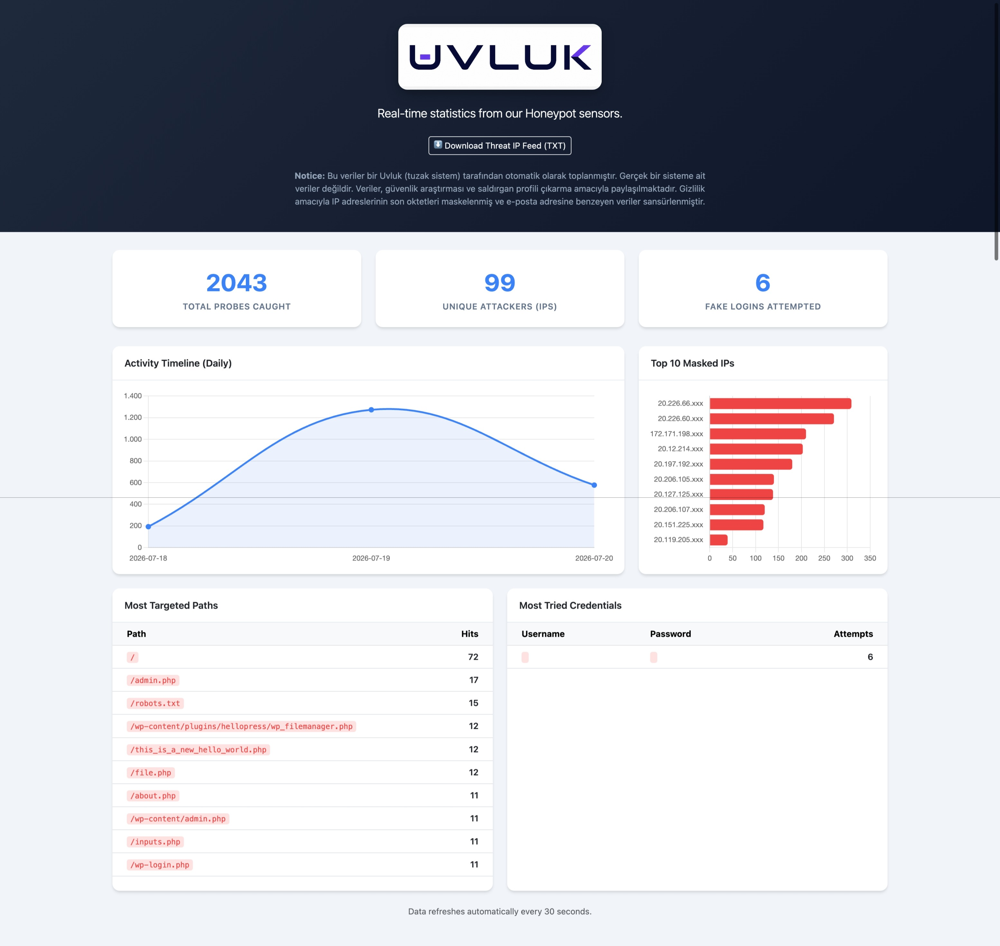
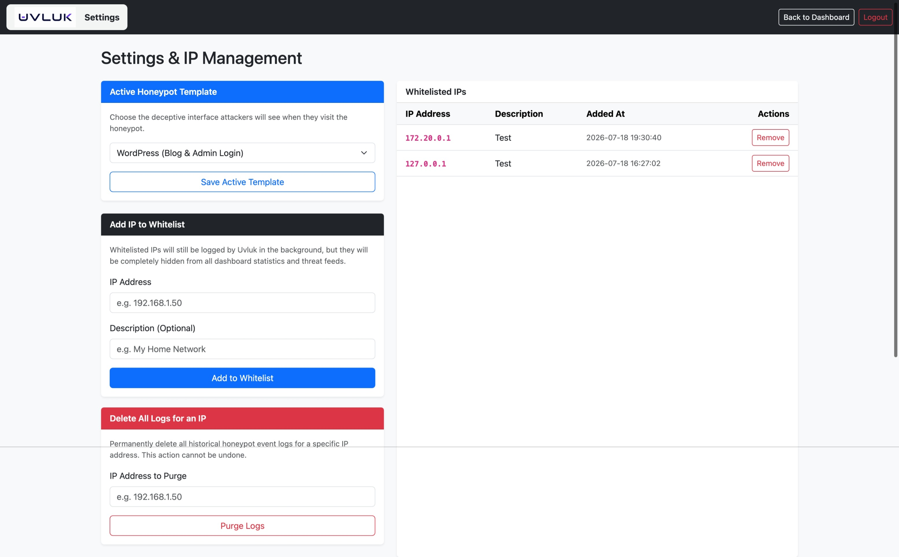
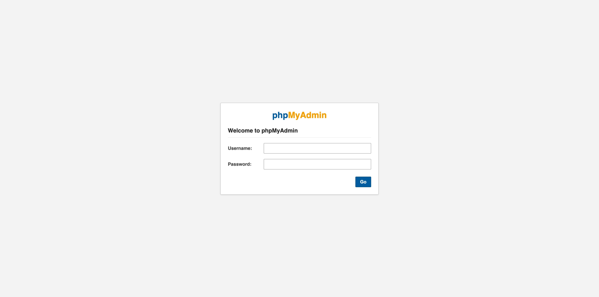
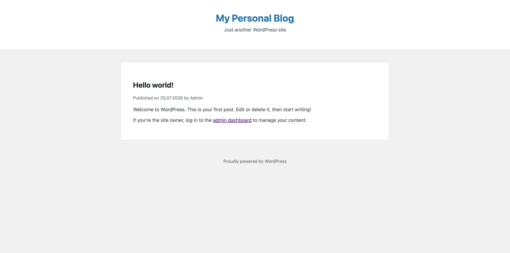
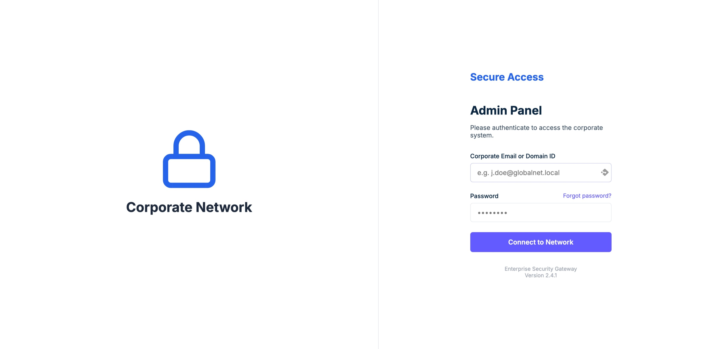
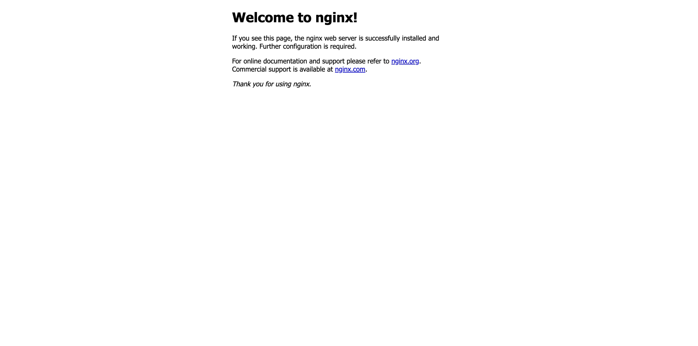
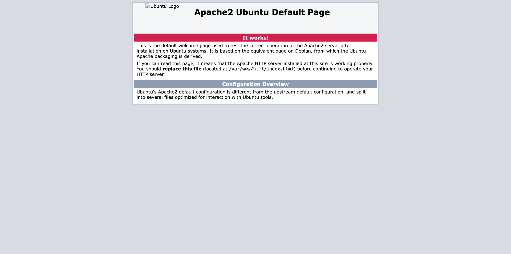
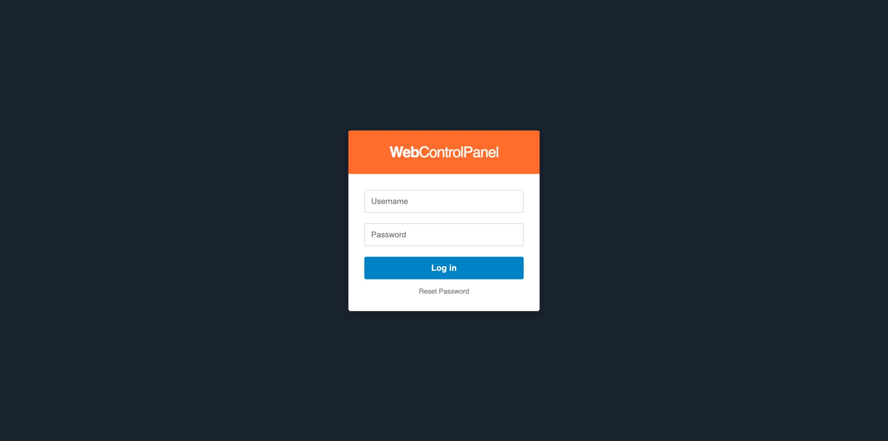
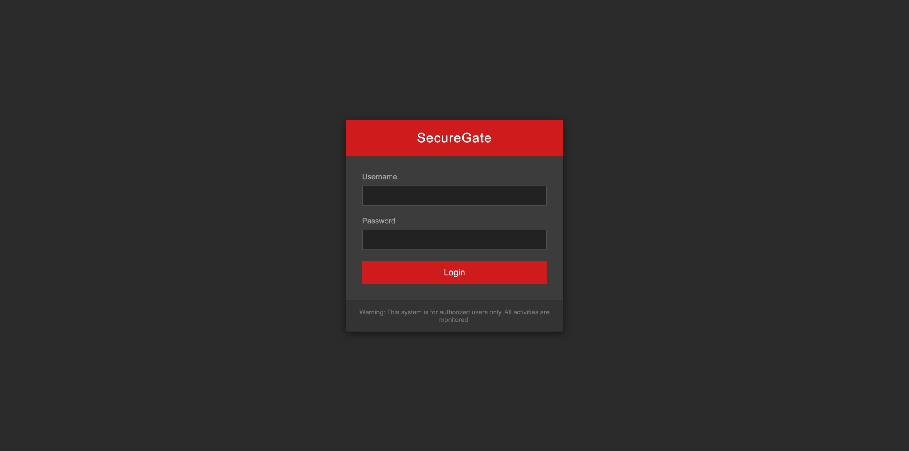

<div align="center">
  
  <h1>Uvluk: Dynamic Web Honeypot & Threat Intelligence System</h1>
  <p><em>An advanced, deceptive, and containerized honeypot system for tracking automated scanners, brute-force bots, and malicious actors.</em></p>

  [](https://www.docker.com/)
  [](https://www.python.org/)
  [](https://flask.palletsprojects.com/)
  [](#license)
</div>

---

## What is Uvluk?

**Uvluk** (derived from a localized term meaning a small, isolated area or trap) is a high-interaction web honeypot system designed to capture, log, and analyze malicious web traffic. It features a unique **Chameleon Engine** that allows it to change its disguise on the fly to trap different types of attackers.

Instead of presenting a static page, Uvluk can morph into high-value targets like an Enterprise Corporate Gateway, a WordPress Admin Panel, a phpMyAdmin login, or a Fortinet Firewall portal with a single click from the Admin Dashboard.

---

## Key Features

- 🦎 **Chameleon Architecture (Dynamic Disguise):** Switch the honeypot's identity instantly without restarting the server.
  - `Generic Enterprise Gateway`
  - `WordPress (wp-login.php & Blog)`
  - `SecureGate Firewall (Fortinet Style)`
  - `Web Control Panel (cPanel/WHM Style)`
  - `phpMyAdmin Login`
  - `Nginx / Apache2 Default Pages`
- **Real-time Admin Dashboard:** A sleek, dark-themed control panel to view attack statistics, top attacker IPs, targeted paths, and captured credentials.
- **Public Threat Feed:** A dedicated, privacy-focused public dashboard and a raw `.txt` threat feed API to share attacker IPs with the community.

---

## 📸 Screenshots

### 1. The Real-time Admin Dashboard

*Interactive charts and detailed logs of captured attacker data.*



### 2. The Chameleon Engine (Settings)

*Switching the honeypot identity instantly.*

### 3. Honeypot Disguises in Action
| Corporate Gateway | phpMyAdmin Trap | WordPress Trap |
| :---: | :---: | :---: |
|  |  |  |
|  |  |  |
|  |  |

---

## Quick Start (Installation)

Uvluk is built entirely on Docker. You don't need to install Python or any dependencies on your host machine.

### 1. Clone the Repository
```bash
git clone https://github.com/yourusername/uvluk-honeypot.git
cd uvluk-honeypot
```

### 2. Configure Environment Variables
Copy the example environment file and set your secure passwords:
```bash
cp .env.example .env
```
*Edit `.env` and change `DASHBOARD_PASS` and `SECRET_KEY` before deploying!*

### 3. Build and Run
Bring up the honeypot and dashboard services in detached mode:
```bash
docker-compose up -d --build
```

---

## Usage & Ports

By default, the services bind to all interfaces (`0.0.0.0`) on the following ports:

- **Honeypot Trap (The Target):** `http://[YOUR-IP]:8080`
  - This is the port you should expose to the internet (e.g., via Cloudflare Tunnel) to catch attackers.
- **Admin Dashboard:** `http://[YOUR-IP]:5050`
  - Access this to view stats and change settings. **Keep this private or behind a WAF/Tunnel.**
- **Public Stats & Feed:** `http://[YOUR-IP]:5050/public` and `/public/threat_feed.txt`

### Cloudflare Tunnel Recommendation
For maximum security, do not expose ports 8080 and 5050 directly through your router. Use **Cloudflare Zero Trust Tunnels** to route traffic directly to the Docker containers without opening any inbound ports on your network.

---

## ⚖️ Legal Disclaimer

Uvluk is developed strictly for **defensive security research, threat intelligence gathering, and educational purposes**. 

The simulated login pages are generic replicas created to study automated scanner behavior. They do not contain any copyrighted code from the original vendors. The developer(s) assume no liability and are not responsible for any misuse or damage caused by this project. Do not deploy honeypots on networks where you do not have explicit authorization to monitor traffic.

---
*Developed with ❤️ for the Cybersecurity Community.*
